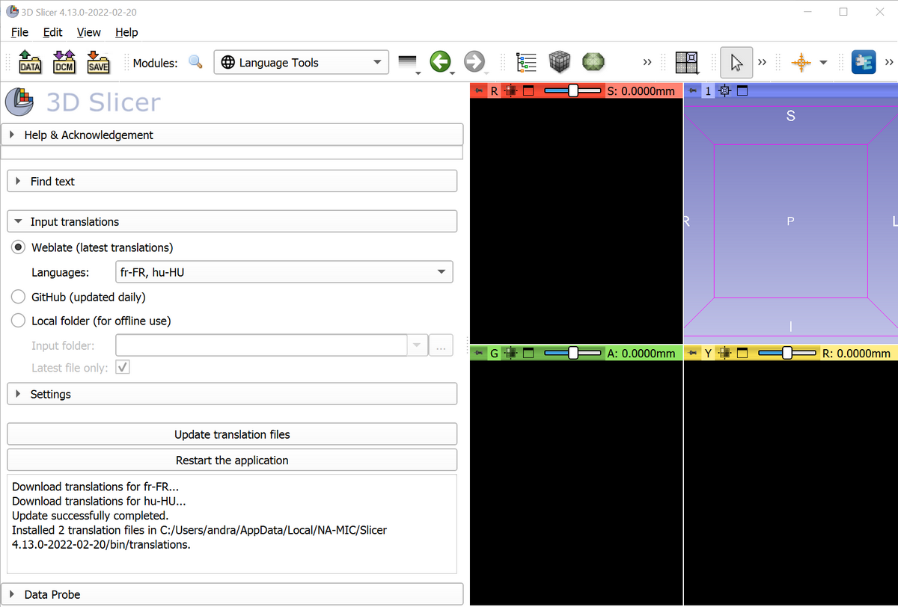

# SlicerLanguagePacks extension

3D Slicer extension for creating, editing, and storing translations for Slicer core and extensions.

Help translate the project on [Hosted Weblate](https://hosted.weblate.org/engage/3d-slicer/).

## How to use

### Setup

- Download and onstall Qt toolkit. It is free. Go to [Qt website](https://www.qt.io/download-open-source), scroll down, click `Download the Qt online installer` button, and follow the instructions. Any Qt version can be used.
  - Qt is required because it contains the `lrelease` tool, which can compile a human-readable translation file(.ts file, that are edited on [Hosted Weblate](https://hosted.weblate.org/project/3d-slicer)) to a binary file (.qm file, that the application can use).
  - The Qt company added many misleading statements on its website to try to trick users into buying a commercial license of Qt with. \
  A commercial license is not needed, even for commercial uses of Qt. The free, open-source version is sufficient.
- [Download](https://download.slicer.org) and install a recent 3D Slicer Preview Release (released 2022-01-28 or later)
- Install SlicerLanguagePacks extension.
  
- In Slicer, go to `Language Tools` module and set `Qt lrelease tool path`. It is located in the folder where Qt was installed.
  - Default location on Windows is something like this: `c:\Qt\5.15.0\msvc2019_64\bin\lrelease.exe`

### Download and install latest translations

- Download latest translation
  - Option A: download automatically from [SlicerLanguageTranslations](https://github.com/Slicer/SlicerLanguageTranslations). This is the easiest way to get updated translation files, but these translations files are updated only once a day.
    - Select `Github` option in `Input translations` section.
  - Option B: manually download a language from Weblate. The manual download requires more steps, but it allows getting the most recent translations immediately.
    - Open [Slicer project in Weblate](https://hosted.weblate.org/project/3d-slicer) and open translation page of a language (for example, [French](https://hosted.weblate.org/projects/3d-slicer/3d-slicer/fr/))
    - From Files → Download translation you can downloadHit 3d-slicer-3d-slicer-fr-ts
    - Select `Crowdin .ts files folder` option in `Input translations` section.
    - Set the download folder path in `Input folder` in `Input translations` section.
    - Note: It is recommended to keep `Latest file only` option checked to only use the latest downloaded .ts file in that folder because the web browser typically does not replace previously downloaded files but just keeps adding files. By enabling this option, all older .ts files are ignored.
  - Option C: manual download of all languages from Hosted Weblate. The manual download requires more steps, but allows getting the most recent translations immediately.
    - Open [Slicer project on Hosted Weblate](https://hosted.weblate.org/project/3d-slicer)
    - Click Files → Download translation as ZIP file to download 3d-slicer-3d-slicer.zip.
    - Select `Crowdin multi-language` option in `Input translations` section.
    - Set the zip file path in `Input ZIP file` in `Input translations` section.
- Compile the translation files and install them into the application by clicking `Update translation files` button.
- Click `Restart the application` button to start using the new translation files.

### Set application language

Language can be selected in menu: Edit -> Application Settings, General section -> Language. If the language selector does not appear then go to "Internationalization" section and toggle the checkbox. The application has to be restarted after changing language.

