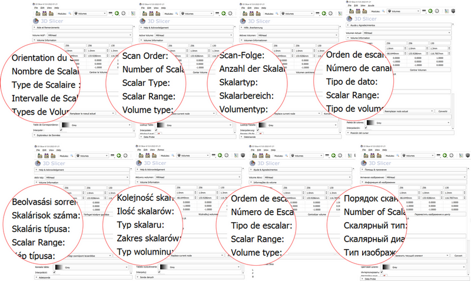
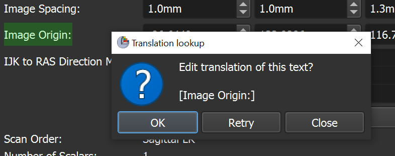

# SlicerLanguagePacks extension

3D Slicer extension for creating, editing, and storing translations for Slicer core and extensions.

Help translate the project on [Hosted Weblate](https://hosted.weblate.org/engage/3d-slicer/). How to translate? Check out the [Translators Manual](TranslatorsManual.md).

## How to use

### Setup

- Download and onstall Qt toolkit. It is free. Go to [Qt website](https://www.qt.io/download-open-source), scroll down, click `Download the Qt online installer` button, and follow the instructions. Any Qt version can be used.
  - Qt is required because it contains the `lrelease` tool, which can compile a human-readable translation file(.ts file, that are edited on [Hosted Weblate](https://hosted.weblate.org/project/3d-slicer)) to a binary file (.qm file, that the application can use).
  - The Qt company added many misleading statements on its website to try to trick users into buying a commercial license of Qt.
  A commercial license is not needed, even for commercial uses of Qt. The free, open-source version is sufficient.
  - On macOS: installer can be downloaded from [here](https://download.qt.io/official_releases/online_installers/qt-unified-mac-x64-online.dmg) or Qt can be installed using Homebrew. If Homebrew is used then `lrelease` is available by default at `/usr/local/Cellar/qt@5/5.15.2/bin/lrelease`.
  - On Ubuntu, after downloading the Qt Installer from the website, open a terminal and move to the Downloads directory. Then, make the file executable (by changing the permissions) and then run the command "./[filename] to launch the installation. When the installation is done, the lrelease file will be located in "/usr/bin/" .
- [Download](https://download.slicer.org) and install a recent 3D Slicer Preview Release (released 2022-01-28 or later)
- Install SlicerLanguagePacks extension.
  
- In Slicer, go to `Language Tools` module and set `Qt lrelease tool path`. It is located in the folder where Qt was installed.
  - Default location on Windows is something like this: `c:\Qt\5.15.0\msvc2019_64\bin\lrelease.exe`

### Download and install latest translations

- Download latest translation
  - Option A: `Weblate`. Download selected langauges directly from Weblate. This allows getting the most recent translations immediately, which is useful for translators wanting to test their translated application immediately.
  - Option B: `GitHub`. Download all languages from [SlicerLanguageTranslations](https://github.com/Slicer/SlicerLanguageTranslations) repository. This is the fastest way to get updated translation files for all languages, but these translations files are updated only once a day.
- Compile the translation files and install them into the application by clicking `Update translation files` button.
- Click `Restart the application` button to start using the new translation files.

### Set application language

Language can be selected in menu: Edit -> Application Settings, General section -> Language. If the language selector does not appear then go to "Internationalization" section and toggle the checkbox. The application has to be restarted after changing language.

For convenience, an application language selector is also added to the Language Tools module, below the `Update translation files` button. Any updated translation files immediately show up in this language selector.

## Tips and tricks

### Find text tool

`Find text` tool is added for quick extraction of text from the application and find occurrences of that text in the translation website:

- Go to Language Tools module
- Open `Find text` section
- Set edited language: the extracted strings will be opened on the website, showing translations in this language. Example: `fr-FR`, `hu-HU`.
- Check `Enable text finder` checkbox
- Hit `Ctrl+6` shortcut anytime to show the widget selector
- Click on the widget that contains translatable text (hit any key to cancel widget selection)
- Click `OK` to open the found text on the translation website

Known limitations:
- The tool only extract widgets from Qt widgets (not from views rendered by VTK library).
- Extraction text from floating and popup windows is not supported.

### Translation of external links

If the translated text contains links to external sites that support multiple languages, it is generally preferable to not hardcode a specific language (to allow that external site to use its own preferred language). For example: <https://docs.github.com/get-started/quickstart/fork-a-repo> is preferred (instead of hardcoding English by adding `/en` like this: <https://docs.github.com/en/get-started/quickstart/fork-a-repo>).

However, not all sites can automatically set a preferred language. For example, [ReadTheDocs](https://readthedocs.org) requires explicitly specifying language code in the URL: <https://docs.godotengine.org/en/stable/tutorials/assets_pipeline/import_process.html> is valid, but <https://docs.godotengine.org/stable/tutorials/assets_pipeline/import_process.html> is an invalid URL. In these cases, the URL of the link should be changed in each translation to match the target language.

See related discussion [here](https://github.com/Slicer/Slicer/pull/6401#discussion_r884768951).

## Advanced use

### Install translation files offline

Translation (.ts) files can be downloaded to a folder and installed from there later, without network access.

Translation files can be downloaded from Weblate or GitHub. For example, open [Slicer project in Weblate](https://hosted.weblate.org/project/3d-slicer) select translation page of a language (such as [French](https://hosted.weblate.org/projects/3d-slicer/3d-slicer/fr/)), then in the menu choose `Files` -> `Download translation`.

Install the translation files:
- Select `Local folder` option
- Set the folder containing .ts file(s) in `Input folder` in `Input translations` section.
- Check `Latest file only` option to only use the latest downloaded .ts file. It is useful if local folder is set directly to the web browser's download folder.
- Compile the translation files and install them into the application by clicking `Update translation files` button.
