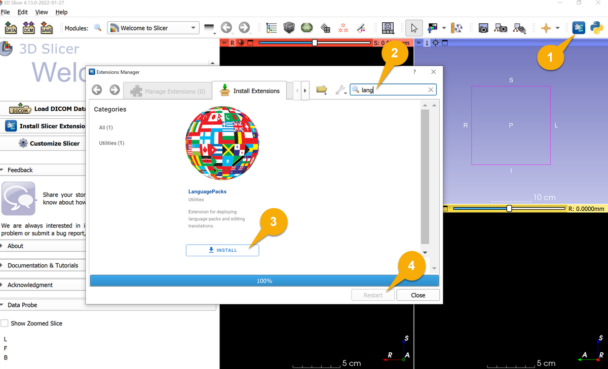

# L'extension SlicerLanguagePacks

Extension 3D Slicer pour la création, l'édition et le stockage de traductions pour le noyau et les extensions de Slicer.

Aidez à traduire le projet sur [Hosted Weblate] (https://hosted.weblate.org/engage/3d-slicer/). Comment traduire ? Consultez le [Manuel des traducteurs](TranslatorsManual.md).

## Mode d'emploi

### Configuration

- Téléchargez et installez Qt toolkit. C'est gratuit. Allez sur le [site web de Qt](https://www.qt.io/download-open-source), faites défiler la page, cliquez sur le bouton "Télécharger l'installateur en ligne de Qt" et suivez les instructions. N'importe quelle version de Qt peut être utilisée.
  - Qt est nécessaire car il contient l'outil `lrelease`, qui peut compiler un fichier de traduction lisible par l'utilisateur (fichier .ts, qui est édité sur [Hosted Weblate](https://hosted.weblate.org/project/3d-slicer)) en un fichier binaire (fichier .qm, que l'application peut utiliser).
  - La société Qt a ajouté de nombreuses déclarations ambiguës sur son site web pour tenter d'inciter les utilisateurs à acheter une licence commerciale de Qt.
  Une licence commerciale n'est pas nécessaire, même pour les utilisations commerciales de Qt. La version gratuite et open-source est suffisante.
  - Sous macOS : le programme d'installation peut être téléchargé depuis [ici](https://download.qt.io/official_releases/online_installers/qt-unified-mac-x64-online.dmg) ou Qt peut être installé en utilisant Homebrew. Si Homebrew est utilisé, `lrelease` est disponible par défaut sur `/usr/local/Cellar/qt@5/5.15.2/bin/lrelease`.
  - Sur Ubuntu, après avoir téléchargé l'installateur Qt depuis le site web, ouvrez un terminal et déplacez-vous dans le répertoire Téléchargements. Ensuite, rendez le fichier exécutable (en modifiant les permissions) puis exécutez la commande "./[nom du fichier] pour lancer l'installation. Une fois l'installation terminée, le fichier lrelease sera situé dans "/usr/bin/" .
- [Télécharger](https://download.slicer.org) et installer une version récente de 3D Slicer Preview Release (sortie le 2022-01-28 ou plus tard).
- Installer l'extension SlicerLanguagePacks.
  
- Dans Slicer, allez dans le module `Language Tools` et définissez le `Qt lrelease tool path`. Il est situé dans le dossier où Qt a été installé.
  - L'emplacement par défaut sous Windows est quelque chose comme ceci : `c:\Qt\5.15.0\msvc2019_64\bin\lrelease.exe`

### Télécharger et installer les dernières traductions

- Télécharger la dernière traduction
  - Option A : `Weblate`. Téléchargez les langues sélectionnées directement depuis Weblate. Cela permet d'obtenir immédiatement les traductions les plus récentes, ce qui est utile pour les traducteurs qui veulent tester leur application traduite immédiatement.
  - Option B : `GitHub`. Téléchargez toutes les langues à partir du dépôt [SlicerLanguageTranslations](https://github.com/Slicer/SlicerLanguageTranslations). C'est le moyen le plus rapide d'obtenir des fichiers de traduction à jour pour toutes les langues, mais ces fichiers de traduction ne sont mis à jour qu'une fois par jour.
- Compilez les fichiers de traduction et installez-les dans l'application en cliquant sur le bouton `Mettre à jour les fichiers de traduction`.
- Cliquez sur le bouton "Redémarrer l'application" pour commencer à utiliser les nouveaux fichiers de traduction.

### Définir la langue de l'application

La langue peut être sélectionnée dans le menu : Editer -> Paramètres de l'application, section Général -> Langue. Si le sélecteur de langue n'apparaît pas, allez dans la section "Internationalisation" et cochez la case. L'application doit être redémarrée après avoir changé de langue.

Pour plus de commodité, un sélecteur de langue d'application est également ajouté au module Language Tools, sous le bouton "Mettre à jour les fichiers de traduction". Tout fichier de traduction mis à jour apparaît immédiatement dans ce sélecteur de langue.

## Conseils et astuces

### L'outil de recherche de texte

L'outil "Find Text" a été ajouté pour extraire rapidement un texte de l'application et trouver les occurrences de ce texte dans le site Web de traduction :

- Allez dans le module Language Tools
- Ouvrez la section `Find Text`.
- Définissez la langue d'édition : les chaînes extraites seront ouvertes sur le site Web, montrant les traductions dans cette langue. Exemple : `fr-FR`, `hu-HU`.
- Cochez la case "Activer la recherche de texte".
- Appuyez sur le raccourci `Ctrl+6` à tout moment pour afficher le sélecteur de widgets.
- Cliquez sur le widget qui contient du texte traduisible (appuyez sur n'importe quelle touche pour annuler la sélection du widget).
- Cliquez sur "OK" pour ouvrir le texte trouvé sur le site de traduction.

Limitations connues :
- L'outil extrait uniquement les widgets des widgets Qt (pas des vues rendues par la bibliothèque VTK).
- L'extraction du texte des fenêtres flottantes et popup n'est pas supportée.

### Traduction des liens externes

Si le texte traduit contient des liens vers des sites externes qui prennent en charge plusieurs langues, il est généralement préférable de ne pas coder en dur une langue spécifique (pour permettre à ce site externe d'utiliser sa propre langue de préférence). Par exemple : <https://docs.github.com/get-started/quickstart/fork-a-repo> est préférable (au lieu de coder en dur l'anglais en ajoutant `/en` comme ceci : <https://docs.github.com/en/get-started/quickstart/fork-a-repo>).

Cependant, tous les sites ne peuvent pas définir automatiquement une langue de préférence. Par exemple, [ReadTheDocs](https://readthedocs.org) exige de spécifier explicitement le code de langue dans l'URL : <https://docs.godotengine.org/en/stable/tutorials/assets_pipeline/import_process.html> est valide, mais <https://docs.godotengine.org/stable/tutorials/assets_pipeline/import_process.html> est une URL invalide. Dans ces cas, l'URL du lien doit être modifiée dans chaque traduction pour correspondre à la langue cible.

Voir la discussion connexe [ici](https://github.com/Slicer/Slicer/pull/6401#discussion_r884768951).

## Utilisation avancée

### Installer les fichiers de traduction hors ligne

Les fichiers de traduction (.ts) peuvent être téléchargés dans un dossier et installés à partir de celui-ci ultérieurement, sans accès au réseau.

Les fichiers de traduction peuvent être téléchargés depuis Weblate ou GitHub. Par exemple, ouvrez [Slicer project in Weblate](https://hosted.weblate.org/project/3d-slicer), sélectionnez la page de traduction d'une langue (telle que [Français](https://hosted.weblate.org/projects/3d-slicer/3d-slicer/fr/)), puis dans le menu choisissez `Files` -> `Download translation`.

Installez les fichiers de traduction :
- Sélectionnez l'option `Dossier local`.
- Définissez le dossier contenant le(s) fichier(s) .ts dans le `Dossier d'entrée` dans la section `Input translations`.
- Cochez l'option `Fichier le plus récent uniquement` pour n'utiliser que le dernier fichier .ts téléchargé. C'est utile si le dossier local est défini directement sur le dossier de téléchargement du navigateur web.
- Compilez les fichiers de traduction et installez-les dans l'application en cliquant sur le bouton "Mettre à jour les fichiers de traduction".
